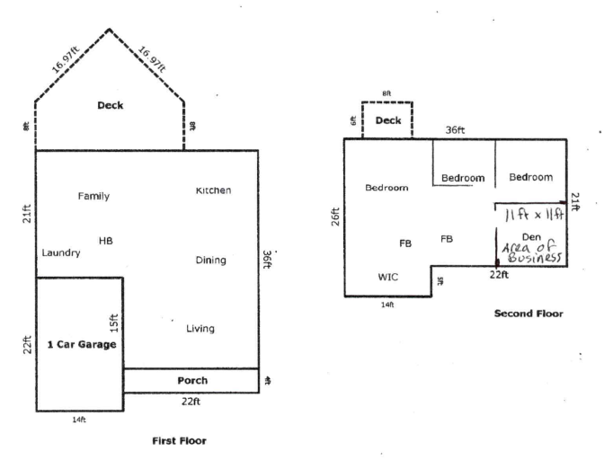

When I decided to start my own company to bootstrap Internet businesses, I knew I would be working from home most of the time. One of the legal requirements to run your business from your home in Anne Arundel County (Maryland) is to get a "Zoning Certificate of Use for Home Occupation".

A lot of people probably skip this step, but in my opinion there is no good reason for taking unnecessary risks. I submitted my application on November 6, 2019 with a rough floor plan (see image below) and a $50 check.

Then the holidays happened, and I promptly forgot all about it.

So I was surprised when an inspector rang my doorbell today. He came up to my office, looked around, asked a couple of questions, and said there shouldn't be any problem. They'll send out the certificate in the mail, and I should have it soon. It was all pretty easy.

Fortunately my office looking like a tornado just ripped through it doesn't disqualify me from getting the certificate. I really need to straighten this place up!
