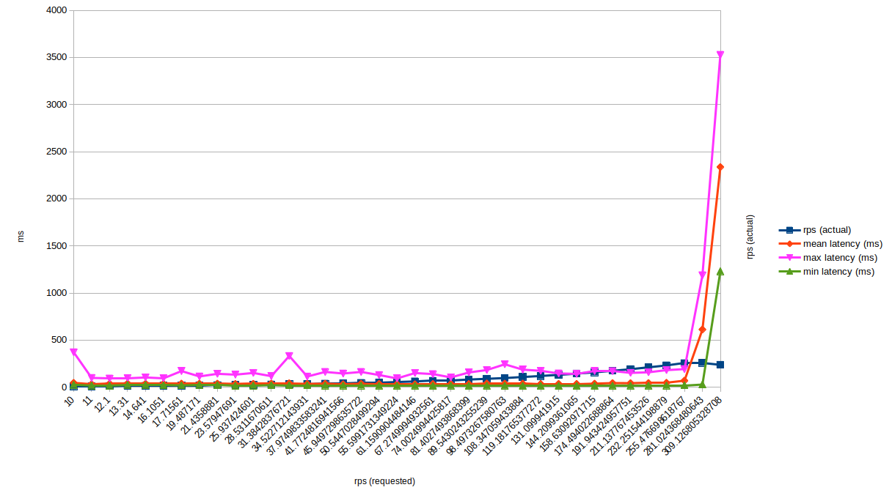
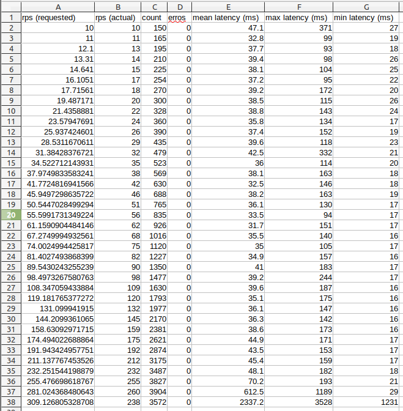
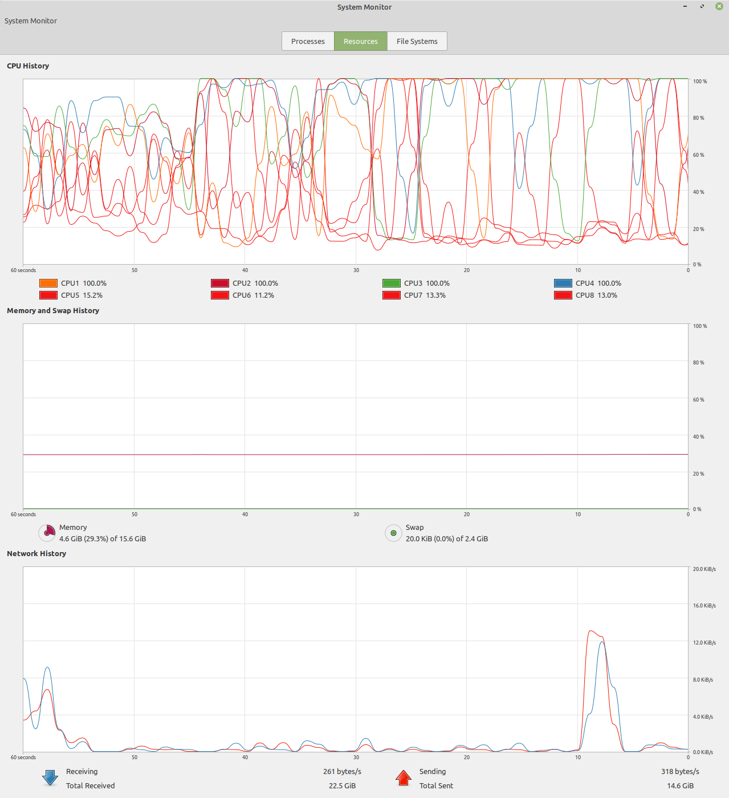
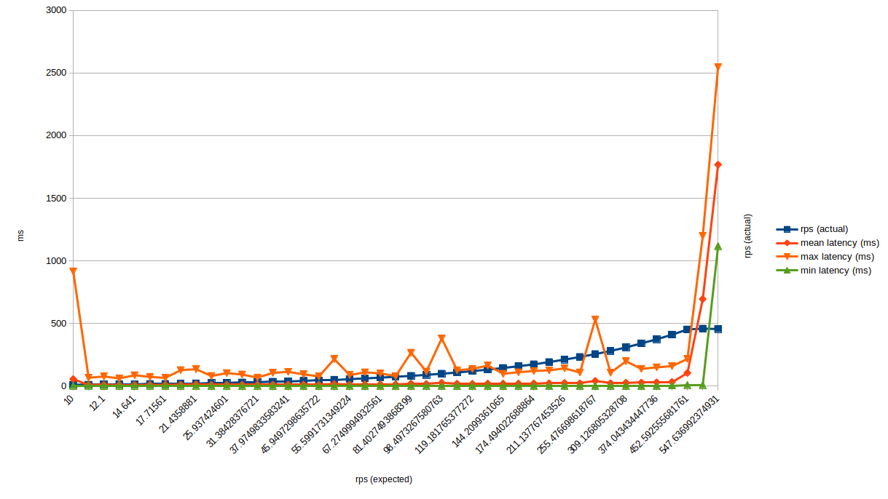
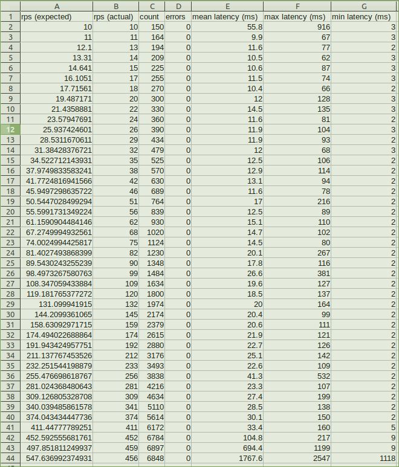
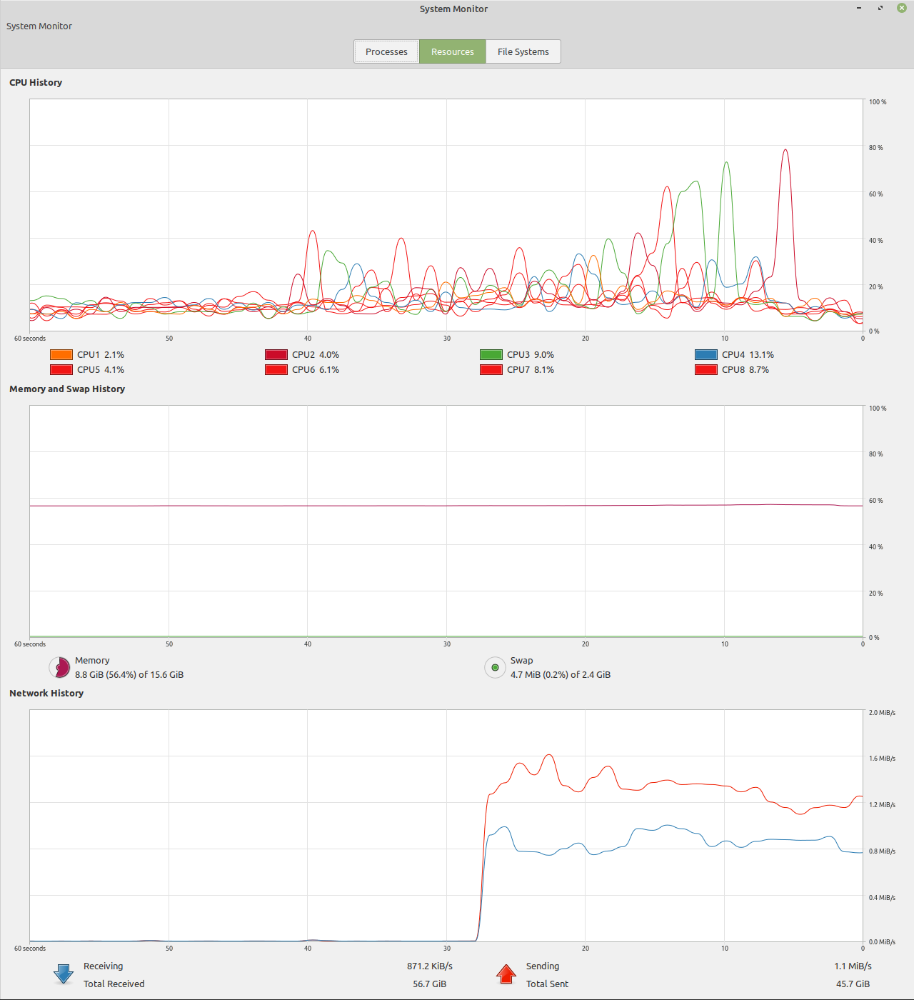

In [the last article](/2020/01/17/email-registration-workflow-nextjs-to-postgresql) I described the implementation of an email registration workflow using Next.js and PostgreSQL. In this article I'll figure out how to do some load testing to see how well my implementation performs.

I'm doing this for a few reasons:
- To figure out the performance characteristics of my implementation. Does performance decrease gradually, or does it just all-of-the-sudden start performing poorly?
- To find some bugs in the implementation.
- To understand bottlenecks that limit performance.

Keep in mind that the actual numbers (e.g. milliseconds of latency) don't mean much. I'm doing this on my development machine, which will be nothing like the production environment (AWS). I still think it's a useful exercise to weed out any obvious bottlenecks and bugs.

## Test Runner

My approach is to measure the latency of the `POST /api/users` REST API endpoint while increasing the number of requests per second made to the endpoint. To accomplish this I will write a script that uses the [loadtest Node.js package](https://www.npmjs.com/package/loadtest) to make simultaneous requests to the endpoint with varying number of clients and the RPS (Requests Per Second). I'll output the data to spreadsheets so I can graph the results.

The test script will run multiple load tests, increasing the concurrency and RPS by 10% each run until the API can no longer keep up with demands of the test (i.e. the difference between the requested RPS and the actual RPS becomes too great).

Here's the entire implementation of my test script. For this first version I'm making concurrency (i.e. the number of clients) match the RPS so that each client is making one request per second.

```
const loadtest = require('loadtest');
const uuid = require('uuid/v1');

const durationSeconds = 15;

const createUserOptions = {
    concurrency: 10,
    requestsPerSecond: 10,
    url: 'http://localhost:3000/api/users',
    method: 'POST',
    maxSeconds: durationSeconds,
    requestGenerator: (params, options, client, callback) => {
        const body = `{"email": "${uuid()}@example.com", "full_name": "${uuid()}", "password": "${uuid()}"}`;
        options.headers['Content-Type'] = 'application/json';
        options.headers['Content-Length'] = body.length;
        options.body = body;
        const request = client(options, callback);
        request.write(body);
        return request;
    }
};

const loadTest = (options) => {
    return new Promise((resolve, reject) => {
        loadtest.loadTest(options, (error, results) => {
            if (error) {
                reject(error);
            } else {
                resolve(results);
            }
        });
    });
};

async function run() {
    let actualRPS = 0;    // Actual requests per second (RPS) for each load test
    let rpsDifference = 0; // Difference between expected and actual RPS.

    // Run repeatedly until the software can't keep up with expected requests per second.
    // Increase the RPS with each run by 10%.
    for (let rps = 100; rpsDifference < 50; rps = rps*1.10 ) {
        const results = await loadTest({...createUserOptions, requestsPerSecond: rps, concurrency: rps});
        actualRPS = results.rps;
        rpsDifference = rps-actualRPS;
        console.log(`${rps},${actualRPS},${results.totalRequests},${results.totalErrors},${results.meanLatencyMs},${results.maxLatencyMs},${results.minLatencyMs}`);
    }
}

run().catch(e => console.error(e));
```

## First Run

The results of the test run show that everything seems to be running well and latency is below 50ms until the requested RPS reaches around 250. Then it increases very rapidly. Here's the graph and the data:




At the time, the CPU utilization on my computer was pretty high, while memory and network usage were low:



## Second Run

My hypothesis is that `bcrypt` hashing of the password is the bottleneck, since that is the most CPU-intensive operation, and we appear to be CPU bound. I temporarily changed the API implementation to remove the use of `bcrypt`, and re-ran the same test.

 The results show that latency is much lower, which is expected because the whole point of `bcrypt` is to cryptographically hash a password in a way that takes a long time (increasing that time as processors get faster). However performance suffers dramatically starting around 500 RPS. Here's the graph and data:
 
 
 
 
 We've only doubled the number of RPS that the endpoint can handle (by removing something critical), but we are no longer CPU bound. Hopefully it gets us closer to finding the next bottleneck.
 


## Third Run

My next hypothesis is that the concurrency in the test runner is affecting performance. How many simultaneous clients can my development machine handle anyway? In the last test when I was requesting 500 RPS the concurrency was also 500, but my machine only has 8 cores. I assume `loadtest` creates 500 threads if you set concurrency to 500, so context switching between those threads may be an issue.

In the third run I set concurrency to half the value of the requested RPS, and re-ran the tests. There was no change in how many RPS the endpoint supported. It started falling over right around 500 RPS.

## Conclusion

I'll continue testing to see if I can find the next bottleneck (e.g. database writes, Node.js connection handling, etc), but the process will be the same:

- Hypothesize about the cause of the last test results
- Figure out how to test the hypothesis
- Run the test and measure the results

Wash, rinse, repeat.

If you have suggestions on what to test and how to measure it, please leave them in a comment below!
