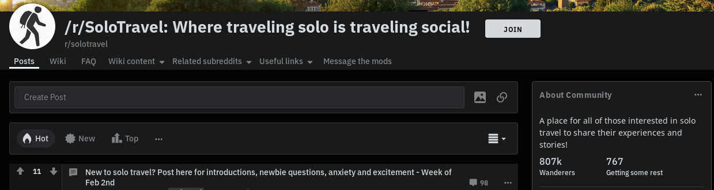

It has been a while since my last blog post! Sorry about that. I've been heads-down figuring out AWS (Amazon Web Services), Next.js, Material-UI, PostgreSQL, etc and implementing [the landing page](https://solotravelbunch.com) for an idea that I had for a website/app to support the solo travel community.

This blog post isn't going to be technical. I'm going to talk about the idea, some initial feedback that I received on it, and where I'm planning to go from here.

## Solo Travel

I have traveled by myself in a few places (Barcelona, skiing/Sundance Film Festival in Utah, and a road trip through the Southeast USA), and really enjoyed the experiences. There is a lot to be said for being able to do and see exactly what you want to.

It turns out I'm not the only person who likes traveling solo. Reddit has [a forum dedicated to solo travel](https://reddit.com/r/solotravel) with over 800k subscribers, and it is growing quickly. A [google search](https://www.google.com/search?q=%22solo+travel%22) will turn up over 12 million search results (articles, blog posts, etc) on the subject. Instagram has over [5.5 million posts tagged with #solotravel](https://www.instagram.com/explore/tags/solotravel/). This seems to be something that a lot of people from all ages and backgrounds are doing.

There are a lot of reasons people choose to travel alone, but some common ones are:

* Personal growth
* Be able to do exactly what you want to on your trip
* You can't find someone who can get away, or who wants to go where you want to
* You want to travel for an extended period of time

## The Idea

Occasionally someone will post on /r/solotravel looking for people to hang out with while traveling (e.g. for drinks or a meal). There are some solutions already out there, the big one being Couchsurfing's hangouts and events features. I suspect these features are mostly seen by younger people who are using Couchsurfing's main feature: finding a place to stay. Dating apps like Tinder and Bundle have features for finding friends, but most people think of those as dating apps. There are also companies that specialize in group travel for singles, but this is more about booking complete travel packages/tours than just finding people to hang out with.

It seems there might be a need for a service for solo travelers that's kind of like meetup.com, but more for finding people near you to do something with. The idea behind Solo Travel Bunch is to help solo travelers "Connect with other solo travelers wherever your adventures take you".

## The Initial Landing Page

A landing page is a single marketing page that describes a service, and has a goal (a.k.a. CTA or Call to Action) such as getting people to sign up for the service. I recently finished the first version of [the landing page for Solo Travel Bunch](https://solotravelbunch):

It describes the overall intent of the service, has a form where people can enter their email addresses to be notified when the service is ready for use, lists features, etc.

## Feedback from Indiehackers.com

Once the landing page was live I started looking for some feedback, and my first stop is indiehackers.com. Indie Hackers is a community of people who are trying to bootstrap profitable Internet businesses. It's a great resource for someone like me who works alone!

I made two posts: one on February 7, 2020 to [Ideas and Validation](https://www.indiehackers.com/post/solo-travel-site-app-37c21a945a), and the other on February 8, 2020 to [Landing Page Feedback](https://www.indiehackers.com/post/my-first-landing-page-is-up-solo-travel-bunch-any-feedback-a2ecaddc26). As of today (February 9, 2020) my posts combined have been viewed 330 times, received 21 comments, and received 12 likes. Two people registered their email addresses to be notified. 

The main takeaways from the comments are:

1. Generally people like the idea
1. Travel is a tough niche, and getting enough people using it might be difficult
1. There were suggestions to narrow the focus (e.g. by age, gender, profession, etc)
1. Verification of members will be important

## Adjusting the Plan

If I want to help solo travelers find other solo travelers to hang out with I'll need to build up a community first.

My plan now is to focus on building out a website that constantly gathers the latest content about solo travel from around the web (e.g. articles, blog posts, videos, social media posts, etc) to drive traffic to the site. I'll want to implement user registration, profiles, comments/discussions on content, and allow solo travelers to submit links to content.

Once the community is large enough I can create the apps for helping solo travelers find other solo travelers to hang out with and know that there's an audience for it.

## Next Steps

I'll start working on aggregating content into Solo Travel Bunch, and once I have that working I'll expand my marketing efforts to get more people to use it. Along the way I'm sure I'll learn more and make more adjustments to the plan!

If you have any ideas or suggestions, feel free to leave a comment below. Thanks!
